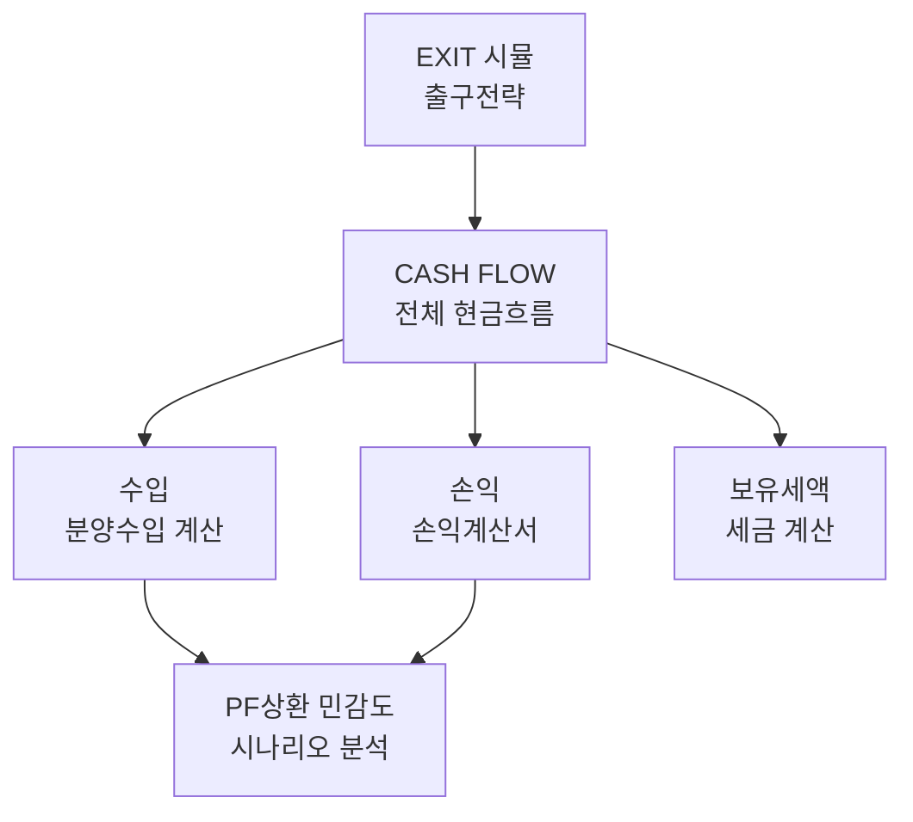

# PF 모델 분석

**대상 파일**: PFX mcp1_ulsan_r3.xlsx  
**분석일**: 2025-01-16  
**상태**: 🔍 구조 분석 중

## 📋 시트 구조 맵

## 🔢 핵심 계산 흐름

### 1. 수입 계산
- **분양수입**: 평형별 × 세대수 × 분양가
- **시기**: 계약금 → 중도금 → 잔금
- **범위**: A1:BH249 (대용량)

### 2. CASH FLOW 통합
- **월별 현금흐름**: 수입 - 지출
- **PF 대출**: 차입 → 상환 스케줄
- **범위**: A1:CD133

### 3. 민감도 분석
- **변수**: 분양률, 금리, 건설비
- **지표**: NPV, IRR, 회수기간
- **범위**: A1:Y36

## 💡 분석 인사이트

### 데이터 구조 특징
- **대용량 데이터**: 수입 시트 249행
- **월별 세분화**: 60개월 이상 기간
- **다중 시나리오**: 분양률별 케이스

### 계산 복잡성
- **의존성 높음**: 시트 간 참조 다수
- **동적 계산**: 분양률에 따른 실시간 변화  
- **민감도 높음**: 소수점 변화가 큰 영향

## 🎯 SaaS 전환 포인트

### API 설계 우선순위
1. **분양수입 계산기**: 평형/세대수 → 총 수입
2. **현금흐름 생성기**: 월별 CF 자동 계산
3. **민감도 분석기**: 변수 변경 → 지표 업데이트

### 사용자 인터페이스
- **대시보드**: 핵심 지표 실시간 표시
- **시나리오 비교**: 여러 케이스 병렬 분석
- **차트**: 현금흐름, 민감도 시각화

## 📝 분석 메모

### 발견사항
- [ ] 일부 시트 간 링크 끊어짐 확인 필요
- [ ] 세금 계산 로직 복잡 → 단계별 분석
- [ ] 분양 스케줄 가변적 → 유연한 설계 필요

### 다음 분석 목표
- [ ] CASH FLOW 시트 상세 분석
- [ ] 핵심 수식 추출 및 Python 변환
- [ ] API 설계서 작성

## 🔗 관련 문서
- [[Excel MCP 설치 보고서]]
- [[개발 로드맵]]
- [[API 설계]]

---
*#pf-analysis #cashflow #modeling*